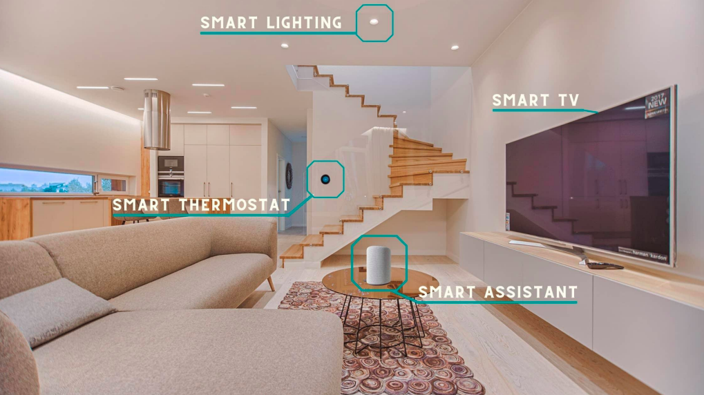
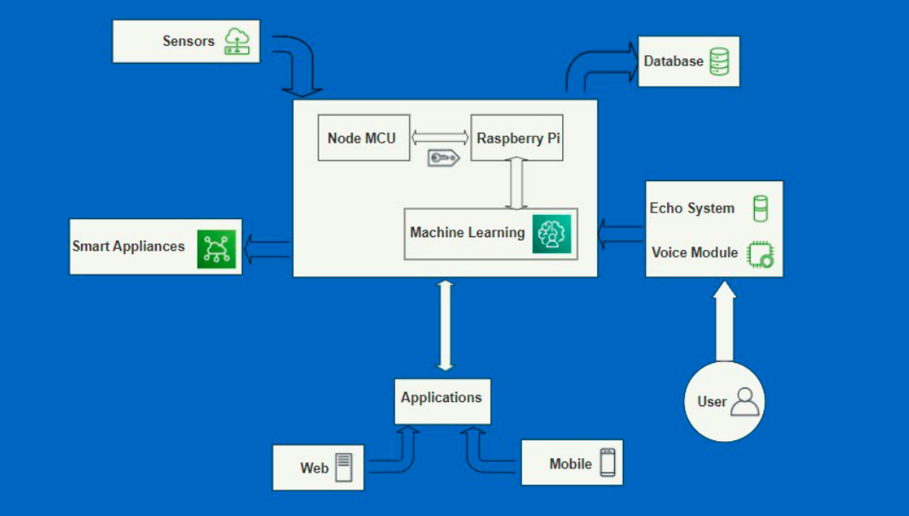

# Smart-Assistant

## Description:
In this project, we will make a smart assistant box which will help with the home-control, like controlling the lighting, controlling the room temperature, asking about date & time, etc This project will facilitate some home activities & make life easier and more comfortable.

## Some Appliances:
* Controlling Your Lights: A wide variety of smart lighting is on the market. While some systems require a so-called bridge, a device that connects talks to the smart light, there are also smart light bulbs with a built-in Wi-Fi connection.
* Controlling a Fan: There are many plug-in appliances, like fans, electric water kettles and coffee makers, that you probably wish were a little bit
smarter. By plugging them into a smart plug, you use a personal assistant to do things like set a specific time for the kettle to heat water in the morning or switch the power on or off remotely. These rely on Wi-Fi to work, so their reliability will only be as good as your signal where they are located.

## Design and control Scheme:
As shown in the bellowing chart, the input for the system will be from the voice module or the applications (website or mobile application), and then it will be from the sensors to sense the environment & start to deal with it in the system.

In the system, the Raspberry Pi/ Node MCU will deal with the order coming from the voice module/ applications and start to analyze the order and use the data coming from sensors with the help of Machine Learning Algorithms, 
and using data previously trained on to apply the order in the home. For example: the user will say close the light, the system will analyze the voice of the user to order the smart bulb to turn-off

